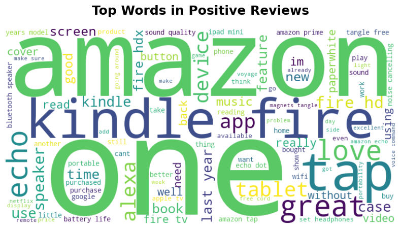
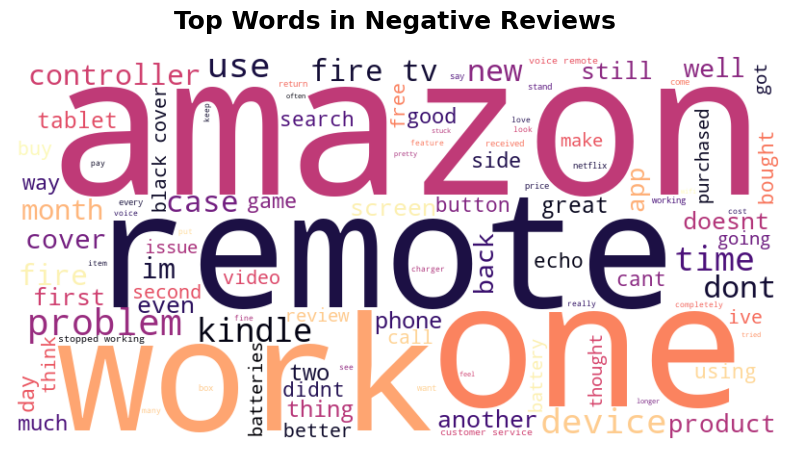

# Technical Report: Sentiment Analysis on Amazon Product Reviews

## 1. Project Overview
The goal of this project is to build an automated system that classifies customer reviews as **Positive** or **Negative**. This helps in understanding customer satisfaction and identifying product issues at scale.

## 2. Data Understanding & Exploration
*   **Dataset:** Amazon Product Reviews.
*   **Key Features:** 
    *   `reviews.text`: The raw text written by the customer.csv].
    *   `reviews.rating`: Numeric score from 1 to 5.csv].
*   **Labeling Strategy:** To create a binary classifier, ratings of 4 and 5 were labeled as **1 (Positive)**, and ratings of 1 and 2 as **0 (Negative)**. Neutral ratings (3) were excluded to maintain clear sentiment boundaries.

## 3. Data Preprocessing Pipeline
To prepare the text for the Machine Learning model, the following steps were applied:
1.  **Lowercasing:** Converting all text to lowercase for consistency.
2.  **Noise Removal:** Using Regular Expressions (Regex) to remove numbers, punctuation, and special characters.
3.  **Stopwords Removal:** Eliminating common English words (e.g., "the", "is", "and") that do not contribute to sentiment.

## 4. Feature Engineering
We converted the cleaned text into a numerical format using **TF-IDF (Term Frequency-Inverse Document Frequency)**. This technique assigns weights to words based on their importance in a specific review relative to the entire dataset.

## 5. Modeling & Handling Imbalance
### Phase 1: Initial Training
We started with **Logistic Regression**. However, the initial report showed a **0% Recall** for negative reviews because the dataset was highly imbalanced (mostly positive reviews).

### Phase 2: Class Weight Balancing
To fix this, we used the `class_weight='balanced'` parameter. This forced the model to pay more attention to the minority class (negative reviews).
*   **Result:** The Recall for negative reviews improved from **0% to 54%**, making the model reliable in real-world scenarios.

### Phase 3: Algorithm Comparison
We compared Logistic Regression with **Multinomial Naive Bayes**. While Naive Bayes had a higher overall accuracy (93.84%), it struggled with the imbalanced data and failed to detect negative reviews, proving that Logistic Regression was the better choice for this specific task.

## 6. Insights from Visualizations
Using **WordClouds**, we identified key patterns:
*   **Positive Reviews:** High frequency of words like "love", "great", "excellent", and product names like "Kindle" and "Echo".
*   **Negative Reviews:** Frequent mentions of "problem", "issue", "dont work", and specifically **"remote"**, suggesting a potential hardware issue with certain devices.
As shown in the WordClouds below, we identified key patterns in customer feedback:

*Figure 1: Positive reviews emphasize product satisfaction and core features.*

*Figure 2: Negative reviews highlight specific hardware issues, notably with the "remote".*

## 7. Modularization & Final Deployment
The code was refactored into a professional structure:
*   `preprocess.py`: For reusable text cleaning.
*   `train.py`: For automated training and model saving (`.pkl` files).
*   `predict.py`: For a ready-to-use inference script to test new reviews.

---
**Report Compiled by:** Ahmed Abdelnaby Ali
**Title:** Machine Learning and AI Engineer